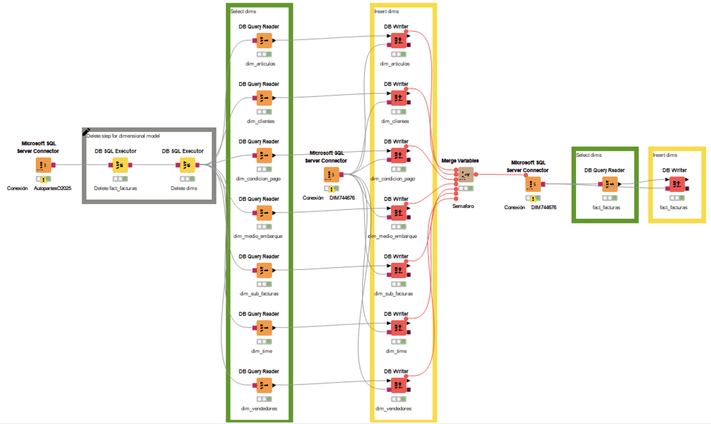

# 🧠 Dimensional Database  
### 📊 Based on a Real Transactional Database  

---

## 🚀 Overview
This project showcases the design and implementation of a **Dimensional Data Warehouse** built from a **real-world transactional database**.  
It demonstrates the **ETL process (Extract, Transform, Load)** and the creation of **star and snowflake schemas** optimized for analytical queries.

---

## 🎯 Objectives
- Transform transactional data into **an analytical model** for business intelligence.
- Apply **data modeling techniques** (fact and dimension tables).
- Use **SQL and visualization tools** for end-to-end analytics.
- Enable **fast, insightful reporting** using OLAP principles.

---

## 🧱 Architecture
```text
Transactional DB  →  ETL (SQL)  →  Dimensional Model  →  Analytics Layer (Tableau)
```

### Below is the ETL workflow image implemented in KNIME, which performs data extraction, transformation, and loading into the dimensional model:

<p align="center">
  
</p>
